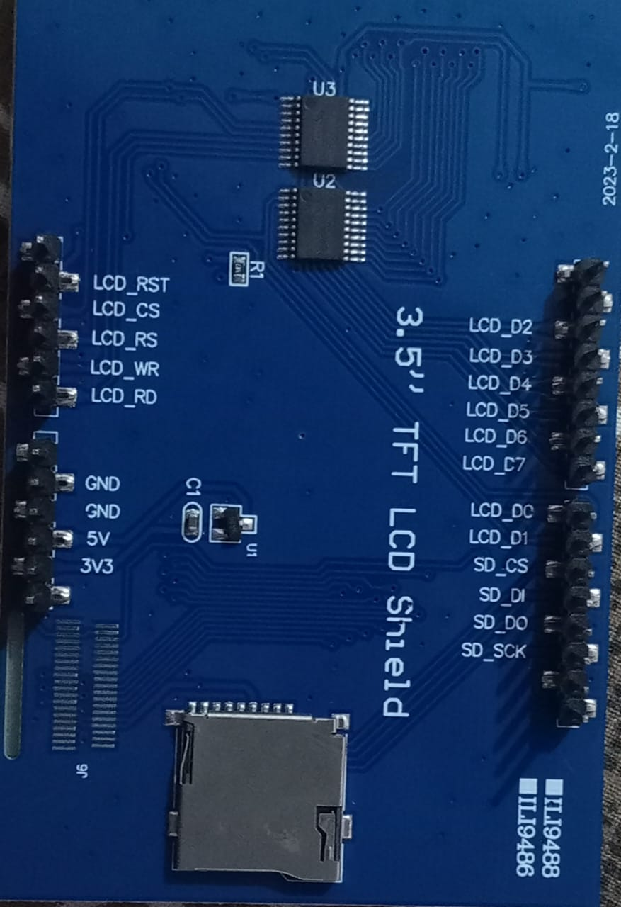
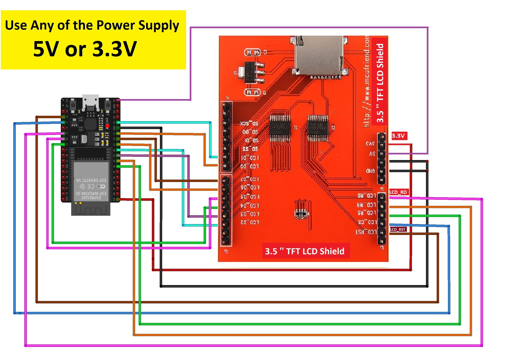

# 📱 Esp32-tft-embedded-portfolio

> Showcasing my **Embedded Systems + UI Development** skills on a **3.5" TFT LCD (ILI9488)** using an **ESP32-S2** microcontroller.  
> Designed to work as a **standalone hardware-based portfolio** — no computer required!

---


## 🚀 Project Highlights

✅ Interactive portfolio UI on 3.5" TFT LCD  
✅ Built with ESP32-S2 microcontroller  
✅ Clean & modern embedded user interface  
✅ Custom-configured **TFT_eSPI** library  
✅ Demonstrates **8-bit parallel & SPI communication**  
✅ SD card media loading support  
✅ Fully standalone — portable & offline

---

## 🛠️ Hardware Components

- ✅ **ESP32-S2** Dev Board  
- ✅ **3.5" TFT LCD** Display (ILI9488 Driver)  
- ✅ **On-board SD Card Module** (SPI interface)  
- ✅ Breadboard + jumper wires  
- ✅ Custom wiring and setup

---

## 📸 Visual Overview

### 🖼️ TFT Display Output  


### 🧠 ESP32 Board Setup  
.

### 🔌 Circuit Connections  


### 🎥 Demo Output  
[▶️ Watch Demo Video](media/Output.mp4)


---

## 🧩 Wiring Connections

### ✅ TFT Display – 8-bit Parallel Mode

| **TFT Pin** | **ESP32-S2 Pin** | **Function**        |
|------------|------------------|---------------------|
| LCD_RD     | GPIO 2           | Read Strobe         |
| LCD_WR     | GPIO 4           | Write Strobe        |
| LCD_RS     | GPIO 15          | Data/Command        |
| LCD_CS     | GPIO 33          | Chip Select         |
| LCD_RST    | GPIO 32          | Reset               |
| LCD_D0     | GPIO 12          | Data Bit 0          |
| LCD_D1     | GPIO 13          | Data Bit 1          |
| LCD_D2     | GPIO 26          | Data Bit 2          |
| LCD_D3     | GPIO 25          | Data Bit 3          |
| LCD_D4     | GPIO 17          | Data Bit 4          |
| LCD_D5     | GPIO 16          | Data Bit 5          |
| LCD_D6     | GPIO 27          | Data Bit 6          |
| LCD_D7     | GPIO 14          | Data Bit 7          |

---

### ✅ SD Card Module – SPI Mode

| **SD Pin**   | **ESP32-S2 Pin** | **Function**              |
|--------------|------------------|---------------------------|
| SD_CS        | GPIO 5           | Chip Select               |
| SD_DI (MOSI) | GPIO 23          | Master Out Slave In       |
| SD_DO (MISO) | GPIO 19          | Master In Slave Out       |
| SD_SCK       | GPIO 18          | Clock                     |

---

## 📁 Project Structure
Esp32-tft-embedded-portfolio
├── Circuit Diagram.jpg
├── Output.mp4
├── TFT_eSPI_modified_liabray.zip
├── TFT_protifolio
│   ├── .theia
│   │   └── launch.json
│   └── TFT_protifolio.ino
├── esp32.jpg
└── tft.jpeg


---
## ✅ Prerequisites

Ensure you have:

- Arduino IDE (preferably latest) → [Download here](https://www.arduino.cc/en/software)  
- ESP32-S2 Development Board  
- 3.5” TFT LCD (ILI9488 driver, 8-bit parallel interface)  
- Jumper wires or a breadboard  
- USB Cable to connect ESP32  
- SD card (FAT32 formatted, optional)

---

## ⚙️ How to Set Up

1. Open **Arduino IDE**
2. Go to `File > Preferences`
3. In the **"Additional Board Manager URLs"** field, paste:

   ```
   https://raw.githubusercontent.com/espressif/arduino-esp32/gh-pages/package_esp32_index.json
   ```

4. Click **OK**
5. Go to `Tools > Board > Boards Manager`
6. Search for **“esp32”** and install the package by **Espressif Systems**
  ✅ Done! ESP32 boards are now available in Arduino IDE.
7. **Download this repository**
8. Extract and place `TFT_eSPI_modified_liabray` in your Arduino `libraries` folder
9. Open `TFT_protifolio.ino` in Arduino IDE or PlatformIO
10. Connect the display and SD card as per the diagram
11. Upload to your ESP32 board
12. Power on and enjoy your embedded resume!

---

## 🔧 TFT_eSPI Configuration Notes

- I modified `User_Setup.h` and `setup.h` for:
  - ILI9488 driver support
  - Custom 8-bit parallel pin mappings
  - Enabling optional SPI for SD card use
- Default SPI was disabled for display (parallel mode used instead)

---

## 💡 Skills Demonstrated

- ✅ Embedded C++ programming
- ✅ ESP32 firmware design
- ✅ Low-level display interfacing (Parallel & SPI)
- ✅ UI/UX layout on constrained hardware
- ✅ Hardware-level troubleshooting
- ✅ Library modification & debugging

---

## 📬 Contact Me

I love building embedded solutions! If you're a **recruiter**, **hiring manager**, or **developer** looking for someone with deep skills in embedded systems, I'd love to connect.

📧 Email: [sai](mailto:cchsaikrishnachowdary@gmail.com)  
🔗 LinkedIn: [linkedin/sai](https://www.linkedin.com/in/sai-krishna-chowdary-chundru)  
💻 GitHub: [github/sAI](https://github.com/sAI-2025)

---

## ⭐ Bonus Ideas

- Touchscreen interaction
- Interactive buttons for skills/projects
- Resume viewer with QR code
- Display-powered kiosk at tech fairs/hackathons

---

## 🙌 Final Thoughts

This isn't just a project — it's a **hardware-based resume** that runs on its own, without any browser or PC. A true demonstration of what I can build from the ground up as an embedded engineer.


